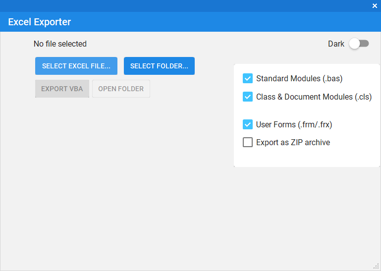
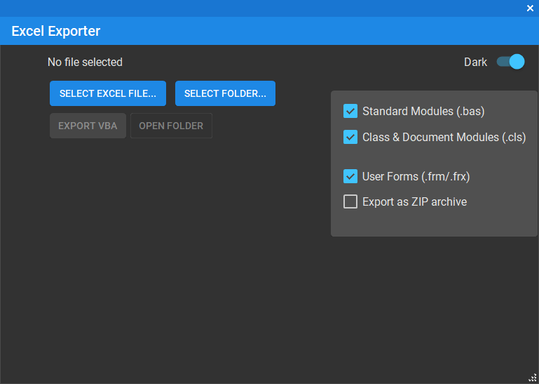

# 📊 Excel Exporter

A lightweight Windows tool to **export VBA code modules** from Excel files (`.xls`, `.xlsx`, `.xlsm`, `.xlsb`, etc.) into plain text files — perfect for **version control**, **backup**, or **code review**.

 
 

Excel VBA Exporter – Free Edition

A lightweight Windows tool to export VBA source code from Excel files into clean, readable files on disk.

Built for developers, power users, and anyone maintaining Excel files with VBA macros.

✅ Free Edition – What You Get

The Free Edition is fully functional for single-file use.

You can:

✔ Export VBA Modules, Class Modules, and UserForms

✔ Work with all common Excel formats:

.xls, .xlsx, .xlsm, .xlsb

.xla, .xlam

legacy and template formats

✔ Export clean .bas, .cls, and .frm files

✔ Automatically organize exports into a folder named after the Excel file

✔ Optionally create a ZIP archive of the exported code

✔ Use a clean GUI with no ads, no time limits, and no nags

If you work with one Excel file at a time, the Free Edition works perfectly and has no artificial limitations.

## 🚀 PRO Edition – Extra Convenience

The PRO edition adds features for users who work with multiple Excel files or need automation:

🔹 Batch export from entire folders

🔹 Command-line (CLI) support for scripting and automation

🔹 Useful for audits, CI pipelines, and large VBA codebases

Nothing else is locked — the PRO edition simply saves time.

# 💵  Pricing

PRO Edition: $5 (one-time)

Yes, it’s intentionally low.
This is not about profit — it’s a small way to support continued development.

No subscriptions

No online activation

No telemetry

No DRM

# 📧 How to Get the PRO Edition

To get the PRO edition:

Send an email to:
# 📧 tsgiannis@gmail.com

You’ll receive payment details
(supported methods: PayPal and Wise)

After payment, you will receive:

The PRO build

Optionally, access to the private GitHub repository (if you want)

That’s it — simple and direct.

# 🧠 Why This Model?

The Free Edition remains genuinely useful

The PRO edition adds convenience, not restrictions

Direct contact builds trust and avoids platform fees

You know exactly who you’re supporting

This tool exists because maintaining VBA-heavy Excel systems is painful — if it saves you time, your support is appreciated.

📜 License

# Free Edition: Open-source (public repository)

# PRO Edition: Distributed privately

If you have feedback, feature ideas, or edge cases — feel free to reach out.
